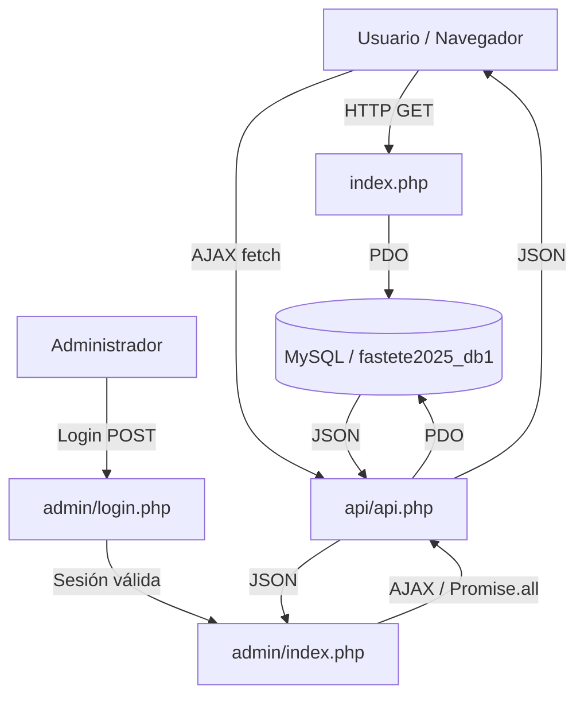
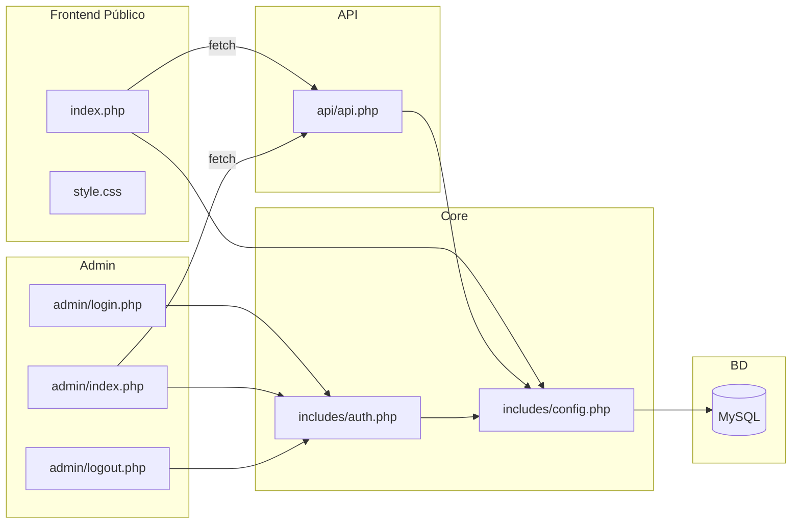
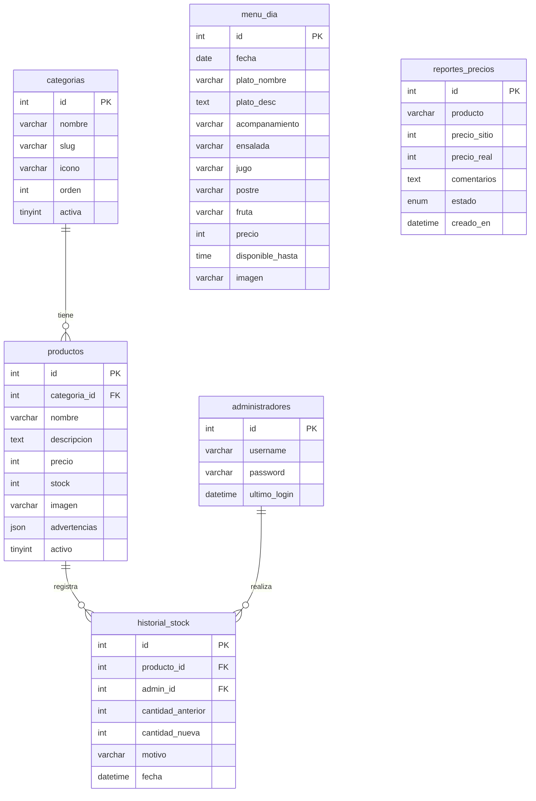
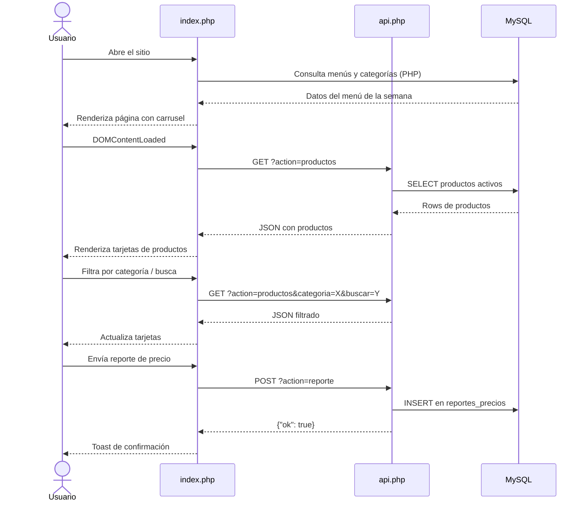
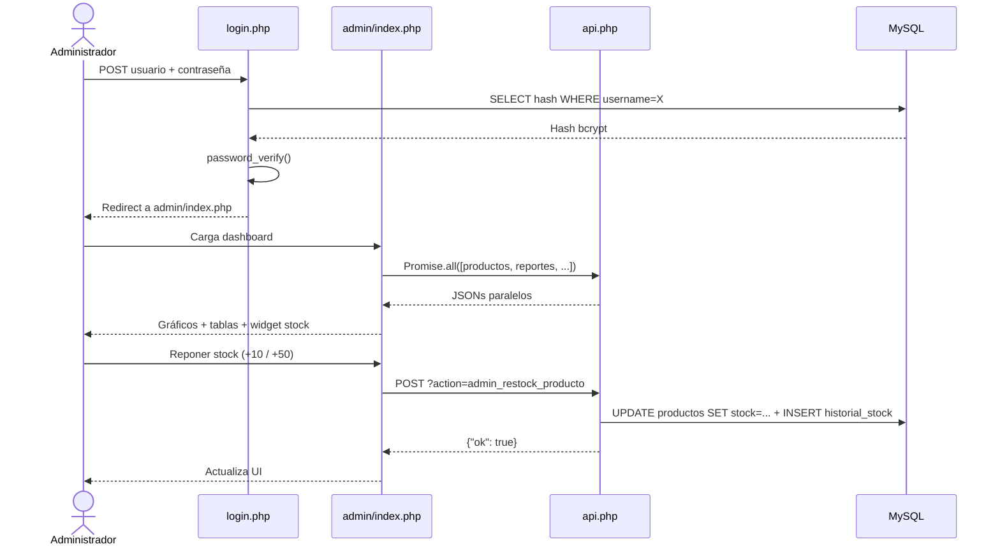

# 🍽️ Casino Universitario — Sistema de Gestión Profesional

> Sistema web completo para la gestión de un casino/comedor universitario chileno. Permite consultar el menú del día, precios y disponibilidad de productos en tiempo real, con un panel de administración completo para gestión de inventario, menús y reportes.

---

## 📋 Tabla de Contenidos

- [Descripción General](#descripción-general)
- [Características](#características)
- [Tecnologías Utilizadas](#tecnologías-utilizadas)
- [Arquitectura del Sistema](#arquitectura-del-sistema)
- [Estructura del Proyecto](#estructura-del-proyecto)
- [Base de Datos](#base-de-datos)
- [Instalación](#instalación)
- [Configuración](#configuración)
- [Uso](#uso)
- [API REST](#api-rest)
- [Módulos del Sistema](#módulos-del-sistema)
- [Roles y Permisos](#roles-y-permisos)
- [Flujo de Trabajo](#flujo-de-trabajo)
- [Seguridad](#seguridad)
- [Solución de Problemas](#solución-de-problemas)
- [Despliegue](#despliegue)
- [Changelog](#changelog)
- [Licencia](#licencia)

---

## 📖 Descripción General

**Casino Universitario** es un sistema web construido sobre PHP puro y MySQL que resuelve la necesidad de los estudiantes y personal universitario de consultar en tiempo real el menú del día, la lista de precios oficial y la disponibilidad de productos del comedor. Elimina la dependencia de listas físicas desactualizadas y centraliza la administración del inventario, los menús semanales y los reportes de inconsistencias de precios.

El sistema está dividido en dos capas:

- **Frontend público** (`index.php`): Consultable por cualquier visitante sin autenticación.
- **Panel de administración** (`admin/`): Accesible exclusivamente por administradores autenticados mediante sesión PHP segura.

La comunicación entre ambas capas se realiza a través de una **API REST propia** (`api/api.php`), que expone endpoints tanto públicos como protegidos.

---

## ✨ Características

### Frontend Público
- Carrusel automático del menú de la semana con imagen de fondo, transición Ken Burns y barra de progreso
- Tarjetas de productos con imagen, estado de stock (`Disponible` / `Últimas unidades` / `Agotado`) y advertencias alimentarias
- Filtros de categoría por tabs (9 categorías) y buscador con debounce (280 ms)
- Modal de detalle por producto con descripción, advertencias e imagen
- Formulario de reporte de errores de precio enviado mediante AJAX (guardado en BD)
- Imagen de respaldo por emoji de categoría cuando la URL de imagen falla (`onerror`)
- Diseño responsive (móvil, tablet, escritorio) con glassmorphism y paleta terracota/ámbar
- Navbar flotante con efecto blur (backdrop-filter) y botón dinámico admin/dashboard según estado de sesión
- Metaetiquetas SEO: `description`, `keywords`, `author`

### Panel de Administración
- Login seguro con bcrypt (PHP `password_verify`)
- Dashboard con estadísticas en tiempo real cargadas en paralelo (`Promise.all`)
- Gráfico de dona: distribución de productos por categoría (Chart.js)
- Gráfico de barras: nivel de stock por categoría (Chart.js)
- Widget de Reposición Rápida: añade +10 o +50 unidades a productos con stock crítico
- CRUD completo de productos con confirmaciones premium (SweetAlert2)
- Editor de menú del día por fecha (CRUD completo)
- Sección de reportes de precios con gestión de estado (pendiente/resuelto)
- Registro automático en historial de stock en cada modificación de inventario
- Cierre de sesión seguro con destrucción de sesión PHP

---

## 🛠️ Tecnologías Utilizadas

| Tecnología | Versión | Propósito |
|---|---|---|
| PHP | 7.4+ | Backend, lógica de servidor, sesiones, API REST |
| MySQL / MariaDB | 5.7+ / 10.x | Base de datos relacional |
| Bootstrap | 5.3.2 | Grid, componentes UI, utilidades responsive |
| Bootstrap Icons | 1.11.1 | Iconografía SVG inline |
| Vanilla JS (ES6+) | — | AJAX (`fetch`), filtros, interactividad, carrusel |
| Chart.js | CDN | Gráficos dinámicos: dona y barras |
| SweetAlert2 | CDN | Diálogos de confirmación y alertas visuales |
| Google Fonts | — | Tipografía: Outfit (títulos) + Plus Jakarta Sans (cuerpo) |
| Unsplash | CDN (URLs) | Imágenes de productos y menús |

---

## 🏗️ Arquitectura del Sistema

### Patrón Arquitectónico

El sistema sigue una arquitectura **MVC ligera sin framework**, caracterizada por:

- **Model**: Consultas PDO directas en `includes/config.php` (función `getDB()`) y en `api/api.php`
- **View**: Plantillas PHP con HTML embebido (`index.php`, `admin/index.php`, `admin/login.php`)
- **Controller**: Lógica de enrutamiento y procesamiento de acciones en `api/api.php` (parámetro `?action=`)

### Flujo General del Sistema



### Componentes y sus Relaciones



---

## 📁 Estructura del Proyecto

```
casino_copia/
│
├── index.php                  ← Frontend público (PHP + HTML + JS en un archivo)
├── style.css                  ← Hoja de estilos completa (CSS variables, responsive, glassmorphism)
├── fastete2025_db1.sql        ← Volcado SQL completo de la base de datos
│
├── includes/
│   ├── config.php             ← Constantes de BD, función getDB() PDO, helpers (e(), str_starts_with polyfill)
│   └── auth.php               ← Gestión de sesiones admin: inicio, verificación, destrucción
│
├── api/
│   └── api.php                ← API REST unificada; enruta por ?action=; responde JSON
│
├── admin/
│   ├── login.php              ← Formulario de login con validación bcrypt
│   ├── index.php              ← Dashboard de administración (Chart.js, SweetAlert2, CRUD)
│   └── logout.php             ← Destrucción de sesión y redirección
│
└── assets/
    └── img/                   ← Carpeta para imágenes locales de productos/menús (opcional)
```

### Descripción de Archivos Clave

**`index.php`**
Página principal del sistema. Al cargar, ejecuta consultas PHP para obtener los menús de la semana y las categorías activas, y los serializa como JSON para el JavaScript del cliente. La carga de productos se realiza completamente por AJAX al evento `DOMContentLoaded`, evitando bloqueo de renderizado. Incluye toda la lógica JS del frontend (carrusel, filtros, buscador, modales, reporte de errores).

**`style.css`**
Define el sistema de diseño completo mediante CSS Custom Properties (`--primary`, `--font-head`, `--shadow-premium`, etc.). Implementa glassmorphism en el navbar, Ken Burns effect en las imágenes del carrusel, y un sistema de badges de stock. Es totalmente responsive con breakpoints Bootstrap.

**`includes/config.php`**
Centraliza la configuración de conexión a base de datos. Expone la función `getDB()` que retorna una instancia singleton de PDO con `FETCH_ASSOC` por defecto y errores en modo excepción. También define la función helper `e()` para escapar HTML (alias de `htmlspecialchars`) y el polyfill de `str_starts_with` para PHP 7.4.

**`includes/auth.php`**
Gestiona el ciclo de vida completo de las sesiones de administrador. Inicia la sesión con cookie `HttpOnly`, `SameSite=Lax` y `Secure` (en HTTPS). Provee funciones para verificar si el admin está autenticado y redirigir si no lo está.

**`api/api.php`**
Punto de entrada único de la API REST. Lee el parámetro `action` de la query string y despacha la lógica correspondiente. Las acciones `admin_*` verifican autenticación de sesión antes de ejecutarse. Siempre responde con `Content-Type: application/json` y estructura `{"ok": bool, "data": ..., "message": ...}`.

---

## 🗄️ Base de Datos

### Motor y Nombre

- **Motor**: MySQL / MariaDB
- **Nombre de BD**: `fastete2025_db1`
- **Script de inicialización**: `fastete2025_db1.sql`

### Esquema de Tablas



### Datos Precargados

- **9 categorías**: bebidas-calientes, bebidas-frías, jugos, energéticas, desayunos, sándwiches, almuerzos, snacks, postres
- **+60 productos chilenos** con precios reales
- **8 menús del día** (semana completa precargada)

---

## 🚀 Instalación

### Requisitos Previos

- [XAMPP](https://www.apachefriends.org) (Apache + MySQL) o servidor LAMP/WAMP equivalente
- PHP 7.4 o superior
- MySQL 5.7 o MariaDB 10.x

### Paso 1 — Instalar XAMPP

Descarga e instala XAMPP. En el Panel de Control, inicia **Apache** y **MySQL**.

### Paso 2 — Copiar el proyecto

Copia la carpeta `casino_copia/` completa a:

| Sistema Operativo | Ruta de destino |
|---|---|
| Windows | `C:\xampp\htdocs\casino_copia\` |
| macOS / Linux | `/opt/lampp/htdocs/casino_copia/` |

### Paso 3 — Importar la base de datos

1. Abre `http://localhost/phpmyadmin` en el navegador
2. Haz clic en **"Nueva"** → escribe `fastete2025_db1` → **Crear**
3. Selecciona la base de datos → pestaña **Importar**
4. Selecciona el archivo `casino_copia/fastete2025_db1.sql`
5. Haz clic en **"Continuar"**

### Paso 4 — Verificar configuración

Abre `includes/config.php` y confirma los valores:

```php
define('DB_HOST',  'localhost');
define('DB_NAME',  'fastete2025_db1');
define('DB_USER',  'root');
define('DB_PASS',  '');                  // Vacío por defecto en XAMPP
define('SITE_URL', 'http://localhost/casino_copia');
```

### Paso 5 — Abrir el sitio

| Vista | URL |
|---|---|
| Frontend público | `http://localhost/casino_copia/` |
| Panel de administración | `http://localhost/casino_copia/admin/login.php` |

---

## ⚙️ Configuración

### Variables en `includes/config.php`

| Constante | Descripción | Valor por defecto | Requerida |
|---|---|---|---|
| `DB_HOST` | Host del servidor MySQL | `localhost` | Sí |
| `DB_NAME` | Nombre de la base de datos | `fastete2025_db1` | Sí |
| `DB_USER` | Usuario MySQL | `root` | Sí |
| `DB_PASS` | Contraseña MySQL | `''` (vacía) | Sí |
| `SITE_URL` | URL base del sitio (sin barra final) | `http://localhost/casino_copia` | Sí |

### Cambiar la contraseña del administrador

Genera un nuevo hash bcrypt:

```bash
php -r "echo password_hash('TuNuevaContraseña', PASSWORD_BCRYPT);"
```

Luego actualiza la tabla `administradores` en phpMyAdmin:

```sql
UPDATE administradores
SET password = '$hash_aqui'
WHERE username = 'admin';
```

---

## 🖥️ Uso

### Credenciales de Administrador

| Campo | Valor por defecto |
|---|---|
| Usuario | `admin` |
| Contraseña | `password` |

> **⚠️ IMPORTANTE:** Cambia la contraseña inmediatamente después del primer ingreso.

### Frontend Público

El frontend no requiere autenticación. Al acceder a `index.php`:

1. El servidor PHP consulta los menús de la semana y las categorías desde MySQL
2. Los datos del carrusel y de categorías se inyectan en el HTML como JSON (`const MENUS_SEMANA = ...`)
3. Al cargar el DOM, JavaScript ejecuta `cargarProductos()` vía `fetch` a la API
4. El usuario puede filtrar por categoría, buscar, o ver el detalle de un producto
5. Si detecta un error de precio, puede abrir el modal de reporte y enviarlo vía AJAX

### Panel de Administración

Accede a `admin/login.php` con las credenciales de administrador. El dashboard carga en paralelo estadísticas de productos, stock crítico y reportes pendientes. Desde aquí puedes:

- Crear, editar y eliminar productos
- Gestionar el menú del día por fecha
- Reponer inventario rápidamente desde el widget de stock crítico
- Marcar reportes de precios como resueltos

---

## 🔌 API REST

Todos los endpoints se acceden via `api/api.php?action=<nombre>`.

### Respuesta Estándar

```json
{
  "ok": true,
  "data": [ ... ],
  "message": "Texto opcional"
}
```

### Endpoints Públicos (sin autenticación)

| Método | action | Descripción | Parámetros |
|---|---|---|---|
| GET | `productos` | Lista de productos activos | `categoria` (slug, opcional), `buscar` (texto, opcional) |
| GET | `categorias` | Lista de categorías activas | — |
| GET | `menu_dia` | Menú del día actual (fallback al próximo disponible) | — |
| POST | `reporte` | Envía un reporte de error de precio | Body JSON: `producto`, `precio_sitio`, `precio_real`, `comentarios` |

#### Ejemplo: GET productos

```
GET /api/api.php?action=productos&categoria=almuerzos&buscar=cazuela
```

```json
{
  "ok": true,
  "data": [
    {
      "id": 15,
      "nombre": "Cazuela de Vacuno",
      "descripcion": "Cazuela tradicional chilena con papas y verduras",
      "precio": 2500,
      "precio_fmt": "$2.500",
      "stock": 30,
      "categoria_slug": "almuerzos",
      "categoria_nombre": "Almuerzos",
      "icono": "bi bi-bowl-hot",
      "advertencias": [],
      "imagen_url": null
    }
  ]
}
```

### Endpoints Protegidos (requieren sesión de administrador)

| Método | action | Descripción |
|---|---|---|
| GET | `admin_listar_productos` | Lista completa de productos (incluye inactivos) |
| POST | `admin_crear_producto` | Crea un nuevo producto |
| POST | `admin_actualizar_producto` | Actualiza un producto existente |
| POST | `admin_eliminar_producto` | Elimina (o desactiva) un producto |
| POST | `admin_restock_producto` | Repone stock de un producto (registra en historial) |
| GET | `admin_listar_menu` | Lista todos los menús del día |
| POST | `admin_crear_menu` | Crea un nuevo menú del día |
| POST | `admin_actualizar_menu` | Actualiza un menú existente |
| POST | `admin_eliminar_menu` | Elimina un menú del día |
| GET | `admin_listar_reportes` | Lista todos los reportes de precios |
| POST | `admin_marcar_reporte` | Cambia el estado de un reporte (pendiente/resuelto) |

---

## 🧩 Módulos del Sistema

### Módulo 1: Frontend Público (`index.php` + `style.css`)

**Objetivo**: Proveer a estudiantes y personal una interfaz visual, rápida y responsive para consultar el menú del día, los precios y el stock en tiempo real.

**Flujo de ejecución**:
1. PHP consulta `menu_dia` y `categorias` en el arranque del servidor
2. Los datos se serializan a JSON y se incrustan en el HTML como constantes JS
3. Al cargar el DOM, `cargarProductos()` hace un `fetch` a la API con el filtro activo
4. `renderProductos()` agrupa los resultados por categoría y genera el HTML de las tarjetas dinámicamente
5. El carrusel se auto-avanza cada 10 segundos con barra de progreso animada mediante CSS `transition`
6. El buscador usa `clearTimeout/setTimeout` (debounce de 280 ms) antes de disparar la llamada a la API

**Componentes JS internos**:

| Función | Propósito |
|---|---|
| `cargarProductos(cat, q)` | Carga productos de la API según filtros activos |
| `renderProductos(productos)` | Agrupa por categoría y genera HTML de tarjetas |
| `cardProducto(p)` | Construye el HTML de una tarjeta de producto individual |
| `filtrarCat(cat, btn)` | Aplica filtro de categoría y recarga |
| `onBuscar(input)` | Gestiona el debounce del buscador |
| `mostrarInfo(p)` | Abre el modal de detalle con los datos del producto |
| `enviarReporte()` | Envía el formulario de reporte de precios vía `fetch POST` |
| `menuGoTo(idx)` | Navega a un slide específico del carrusel |
| `showToast(msg, tipo)` | Muestra notificación flotante de éxito o error |
| `escHtml(str)` | Sanitiza strings antes de insertarlos en el DOM (prevención XSS) |

### Módulo 2: API REST (`api/api.php`)

**Objetivo**: Centralizar toda la lógica de negocio en una capa de datos accesible por JSON.

**Flujo de ejecución**:
1. Incluye `config.php` y `auth.php`
2. Lee el parámetro `action` de `$_GET`
3. Para acciones `admin_*`, verifica la sesión activa; si falla, retorna `{"ok": false, "message": "No autorizado"}` con HTTP 403
4. Ejecuta la consulta PDO correspondiente
5. Retorna `header('Content-Type: application/json')` + `json_encode($response)`

### Módulo 3: Panel de Administración (`admin/`)

**Objetivo**: Permitir al administrador gestionar el inventario, los menús del día y los reportes de precios desde una interfaz visual con gráficos en tiempo real.

**Flujo de carga del dashboard**:
```javascript
// Llamadas en paralelo al cargar la página
Promise.all([
    fetch('api/api.php?action=admin_listar_productos'),
    fetch('api/api.php?action=admin_listar_reportes'),
    // ... otras llamadas
]).then(responses => { /* inicializar gráficos y tablas */ });
```

**Gráficos Chart.js**:
- **Dona**: Cuenta de productos por categoría. Datos calculados desde la respuesta de `admin_listar_productos` agrupando por `categoria_nombre`.
- **Barras**: Stock total por categoría. Suma de `stock` por categoría para identificar las más agotadas.

**Widget Reposición Rápida**:
Filtra productos con `stock <= 5`, los muestra en una lista y dispara `admin_restock_producto` con `+10` o `+50` unidades. Cada reposición se registra en la tabla `historial_stock`.

### Módulo 4: Autenticación (`includes/auth.php`)

**Objetivo**: Garantizar que solo administradores autenticados accedan al panel.

**Mecanismo**:
- Login en `admin/login.php`: consulta el hash bcrypt del administrador en la BD y lo verifica con `password_verify()`
- Sesión iniciada con `session_name('casino_admin_session')` y opciones seguras
- Cada petición al panel llama a la función de verificación de `auth.php`; si `$_SESSION['admin_id']` no está definido, redirige a `login.php`

---

## 👥 Roles y Permisos

| Rol | Acceso | Capacidades |
|---|---|---|
| **Visitante** (no autenticado) | Frontend público (`index.php`) | Ver menú del día, consultar productos y precios, enviar reporte de errores de precio |
| **Administrador** (sesión activa) | Panel admin (`admin/`) + API protegida | Gestión completa de productos, menús y reportes; reposición de stock; acceso al dashboard analítico |

El sistema no implementa múltiples roles de administrador; existe una única tabla `administradores` con un único usuario por instalación.

---

## 🔄 Flujo de Trabajo

### Flujo del Usuario Final



### Flujo del Administrador



---

## 🔐 Seguridad

| Medida | Implementación |
|---|---|
| Contraseñas hasheadas | `password_hash()` / `password_verify()` con bcrypt (PHP) |
| Sesiones seguras | Cookie `HttpOnly`, `SameSite=Lax`, `Secure` en HTTPS |
| Prevención XSS | `htmlspecialchars()` en PHP (`e()`) y `escHtml()` en JS (escapa `&`, `<`, `>`, `"`, `'`) |
| Autenticación en API | Verificación de `$_SESSION['admin_id']` en todas las acciones `admin_*` |
| Consultas preparadas | PDO con `prepare()` + `execute()` en todas las consultas de escritura |

---

## 🛠️ Solución de Problemas

| Error | Causa probable | Solución |
|---|---|---|
| `Error de conexión a MySQL` | MySQL no está corriendo o credenciales incorrectas | Iniciar MySQL en XAMPP; revisar `config.php` |
| `Página en blanco` | Error PHP silenciado | Agregar `error_reporting(E_ALL); ini_set('display_errors',1);` al inicio de `config.php` |
| `No carga la API` | Apache detenido | Iniciar Apache en XAMPP; abrir directamente `http://localhost/casino_copia/api/api.php?action=productos` |
| `No puedo hacer login` | Contraseña incorrecta o hash corrupto | Ejecutar el SQL de restablecimiento en phpMyAdmin (ver sección Configuración) |
| `Imágenes rotas` | URL de Unsplash inaccesible | El sistema tiene fallback automático a emoji de categoría |

Para restablecer la contraseña de administrador a `password`:

```sql
UPDATE administradores
SET password = '$2y$12$92IXUNpkjO0rOQ5byMi.Ye4oKoEa3Ro9llC/.og/at2.uheWG/igi'
WHERE username = 'admin';
```

---

## 🚢 Despliegue

### Entorno de Desarrollo (XAMPP)

Sigue la guía de [Instalación](#instalación) arriba.

### Entorno de Producción (VPS / cPanel)

1. Subir todos los archivos al directorio público del servidor (`public_html/casino/` o similar)
2. Crear la base de datos en el panel del hosting e importar `fastete2025_db1.sql`
3. Actualizar `includes/config.php` con las credenciales de producción y la URL final:
   ```php
   define('DB_HOST',  'localhost');
   define('DB_NAME',  'tu_bd_produccion');
   define('DB_USER',  'tu_usuario_bd');
   define('DB_PASS',  'tu_password_seguro');
   define('SITE_URL', 'https://tudominio.com/casino');
   ```
4. Asegurarse de que el servidor tenga PHP 7.4+ con las extensiones `pdo_mysql` y `mbstring` habilitadas
5. Configurar HTTPS (certificado SSL) para activar las cookies `Secure`

### Consideraciones de Producción

- Cambiar la contraseña del administrador inmediatamente
- Deshabilitar `display_errors` en PHP (`ini_set('display_errors', 0)`)
- Configurar el archivo `.htaccess` para denegar el acceso directo a `includes/` y `api/api.php` excepto desde el dominio propio
- Hacer backups periódicos de la base de datos

---

## 📝 Changelog

### v1.1.0 — Actualización Profesional (Junio 2026)

**Errores corregidos:**
- Polyfill PHP 7.4 para `str_starts_with()` agregado en `config.php`
- Ruta 404 del CSS en el panel de administración corregida (`../style.css`)
- Contraseña de ejemplo en el login corregida de `admin123` → `password`
- Parámetros nulos en la función `e()` soportados (evita warnings en PHP 8.1+)
- Corte incorrecto de caracteres UTF-8 en el carrusel de menús (uso de `mb_substr`)
- Función `escHtml` en JS ahora escapa comillas simples y dobles (prevención XSS completa)
- Clave foránea faltante en la tabla `historial_stock` agregada

**Mejoras:**
- Rediseño visual completo: paleta terracota/ámbar, glassmorphism, sombras premium
- Gráficos dinámicos en el dashboard: dona + barras (Chart.js)
- Widget de Reposición Rápida de inventario (+10 / +50 desde el dashboard)
- Registro automático en `historial_stock` al modificar stock de cualquier producto
- Nueva acción API `admin_restock_producto`
- Sesiones PHP endurecidas: `HttpOnly`, `SameSite=Lax`, `Secure` en HTTPS
- Imágenes rotas reemplazadas por emoji de categoría (fallback `onerror`)
- SweetAlert2 integrado para confirmaciones y alertas premium
- Llamadas API en paralelo (`Promise.all`) en el dashboard
- Metaetiquetas SEO añadidas al frontend

---

## 📋 Resumen Técnico

| Aspecto | Detalle |
|---|---|
| **¿Qué hace?** | Sistema web para casino universitario: menú del día, precios, stock e inventario |
| **¿Cómo está construido?** | PHP puro + MySQL en el backend; Bootstrap 5 + Vanilla JS en el frontend; API REST propia |
| **¿Cómo se ejecuta?** | XAMPP (Apache + MySQL); importar SQL; abrir `localhost/casino_copia/` |
| **¿Cómo contribuir?** | Editar `api/api.php` para nuevos endpoints; extender `admin/index.php` para nuevas vistas; ajustar CSS en `style.css` |
| **Seguridad** | bcrypt + sesiones seguras + PDO prepared statements + escape XSS en cliente y servidor |
| **Sin dependencias NPM** | Todo vía CDN; no requiere `composer`, `npm` ni proceso de build |

---

## 📄 Licencia

Este proyecto fue desarrollado como sistema interno para un casino universitario chileno. No se especifica una licencia pública de código abierto. Para uso, distribución o modificación del código, consulta con el autor del proyecto.

---

*Sistema desarrollado para casino universitario chileno · 2026*